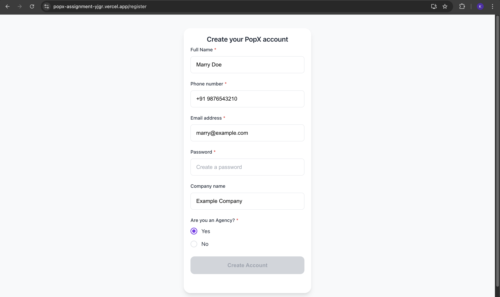
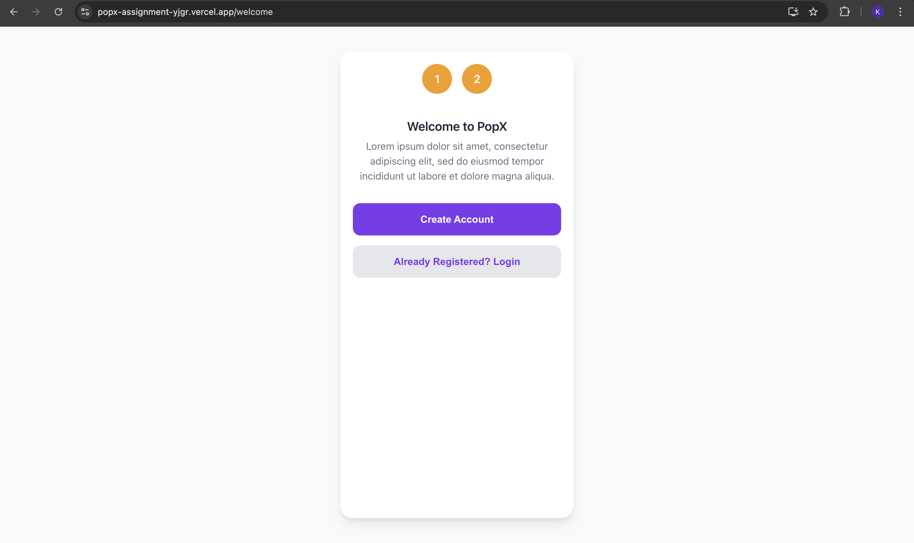
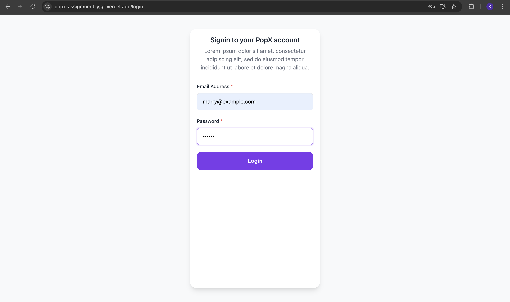
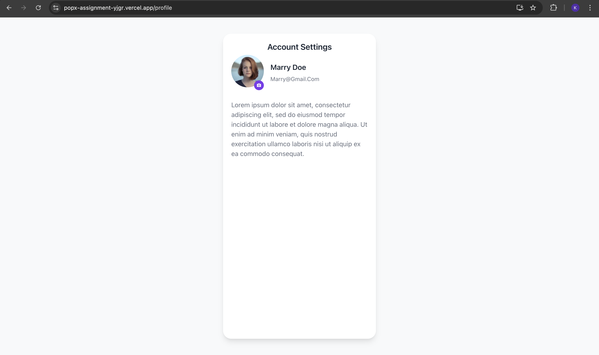

# PopX Mobile App 📱

A pixel-perfect React.js mobile application built as an internship qualifier task. Features a modern UI with seamless navigation across 4 screens.

  

## 🎥 Demo Video

- 🎬 [Watch Demo on YouTube](https://www.youtube.com/watch?v=tszaCae-02I)

## 📸 Screenshots

| InputField | Form Integration |
|------------|------------------|
|  |  |

| DataTable | Responsive Demo |
|-----------|-----------------|
|  |  |


## 📖 Overview
PopX is a mobile-first web application that demonstrates modern React development practices. Built from Adobe XD designs, it showcases user authentication flows and profile management with a clean, professional interface.

## ✨ Features
- **4-Screen Navigation Flow** - Welcome → Login → Register → Profile
- **Responsive Design** - Mobile-first, centered on desktop
- **Form Validation** - Real-time input validation
- **Modern UI** - Clean design with smooth transitions
- **Cross-browser Compatible** - Works on all modern browsers

## 🛠 Tech Stack
- **Frontend:** React.js, React Router DOM
- **Styling:** CSS3, CSS Modules
- **State Management:** React Hooks & Context API
- **Build Tool:** Create React App
- **Deployment:** Netlify/Vercel

## 🚀 Quick Start

### Prerequisites
- Node.js 14.0 or higher
- npm or yarn

### Installation
```bash
# Clone the repository
git clone https://github.com/yourusername/popx-app.git

# Navigate to project directory
cd popx-app

# Install dependencies
npm install

# Start development server
npm start
```

### Build for Production
```bash
npm run build
```

## 📱 Screen Overview
1. **Welcome Page** - Landing page with CTA buttons
2. **Login Screen** - User authentication form
3. **Registration** - New user signup with validation
4. **Account Settings** - User profile management

## 📁 Project Structure
```
src/
├── components/
│   ├── Layout/
│   ├── Auth/
│   ├── Profile/
│   └── UI/
├── styles/
├── context/
└── assets/
```

## 🎯 Key Highlights
- ✅ Pixel-perfect design implementation
- ✅ Clean, maintainable code
- ✅ Modern React best practices
- ✅ Production-ready deployment
- ✅ Mobile-optimized performance

## 📞 Contact
**[Your Name]**
- LinkedIn: [Your LinkedIn]
- GitHub: [Your GitHub]
- Email: [Your Email]

## 📄 License
MIT License - feel free to use this project for learning purposes.

---
Built with ❤️ for internship application
